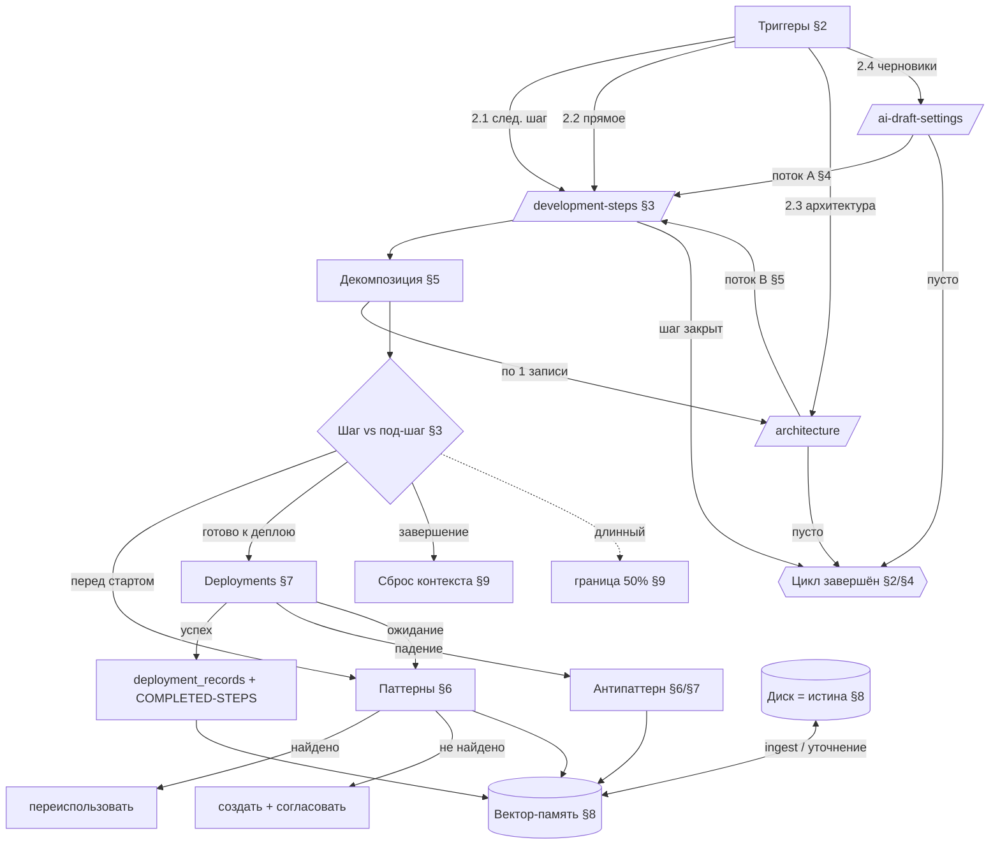

# Методология разработки — мастер-стандарт

> **Это НАД-документ.** Он описывает, **как агент ведёт разработку** внутри этого воркспейса как
> единый процесс — от осмысления задания до подтверждённого развёртывания. Низкоуровневые механики
> каждой поверхности живут в соседних стандартах; здесь они **сшиты в один жизненный цикл** и **не
> дублируются**. Документ написан на русском намеренно (язык авторитетного замысла архитектора);
> публичный англоязычный порт — отдельный шаг.
>
> **Соседние стандарты, на которые опирается этот документ** (папка `CRUD-DOCS/workspace-standards/`):
> [`development-loop.md`](./development-loop.md) · [`development-steps.md`](./development-steps.md) ·
> [`architecture.md`](./architecture.md) · [`ai-draft-settings.md`](./ai-draft-settings.md) ·
> [`patterns.md`](./patterns.md) · [`shell-component-architecture.md`](./shell-component-architecture.md) ·
> [`crud-docs.md`](./crud-docs.md). Операционные правила агента — в `app/CLAUDE.md` (а также
> `AGENTS.md`/`GEMINI.md`/`QWEN.md`).

---

## §0. Назначение и слой

**Что это.** Авторитетное описание методологии: как любое задание превращается в осмысленное,
протестированное, развёрнутое и записанное изменение, и кто что делает на каждом такте. Это карта
поверх стандартов, а не их пересказ.

**Слой — product / FNS.** Документ принадлежит **продуктовому слою** (`ai-workspace/app/…`): он
едет к каждому клиенту с клоном репозитория и описывает работу агента **внутри развёрнутого
воркспейса**. Это не dev-session-инструкция сборки платформы.

**Отношение к `development-loop.md`.** `development-loop.md` описывает **природу** приложения — цикл
из 8 стадий (запрос → Hermes → агент → код → тест → деплой → запись). Настоящий документ описывает
**дисциплину агента внутри этого цикла**: какие задания запускают разработку, как дробить работу на
шаги/под-шаги, как переиспользовать паттерны, когда деплоить, как обращаться с памятью и токенами.
Loop — что происходит; методология — как агент действует.

**Граница (разворот 2026-06-16).** `app/` — **сменный слот** под любой репозиторий. Методология НЕ
навязывает слоту выбор static/dynamic — она про процесс разработки, а не про архитектуру конкретного
гостевого приложения. Инвариант статической генерации относится только к платформенной витрине FES.

---

## §1. Сущности разработки

С чем агент взаимодействует, ведя разработку. Каждая — **реальный артефакт**, не абстракция.

| Сущность | Где живёт | Роль в разработке | Стандарт |
|---|---|---|---|
| **Страница шагов** `/development-steps` | файлы `DEVELOPMENT-STEPS/{NEW-STEPS,COMPLETED-STEPS}/<NN>-slug.md` | журнал работы: открыть / вести / закрыть шаг | `development-steps.md` |
| **Страница архитектуры** `/architecture` | `README.md` + `_meta.ts` на каждый маршрут; задачи через API | карта страниц/эндпоинтов; здесь оставляют задания (Todo, запросы страниц, danger-запросы) | `architecture.md` |
| **AI Draft Settings** `/ai-draft-settings` | `AI-DRAFT-SETTINGS/<AGENT>/{инструкция,SKILLS,MCP}` | черновики пожеланий к инструкциям / навыкам / MCP шести агентов | `ai-draft-settings.md` |
| **Deployments** (панель админки, `:3002`) | таблица `deployment_records`; `POST /api/deploy`, `GET /api/deploy/status` | контроль развёртываний: журнал «как строится проект» (агент / модель / токены / оценка) | §7 ниже |
| **Паттерны / Антипаттерны** `/patterns` | `PATTERNS/{PATTERNS/<категория>,ANTI-PATTERNS}/<NN>-slug.md` | библиотека переиспользования + ловушки деплоя | `patterns.md` |
| **Вектор-память (Company Memory)** | LightRAG `:9621` через `/api/rag/{status,query,ingest}` | семантический слой над диском: предварительная выборка контекста | `development-loop.md`, `app/CLAUDE.md` §7–8 |
| **Файловая система** | весь репозиторий слота | **авторитетный источник истины** (см. §8) | — |
| **Навыки / агенты / MCP** | `AI-DRAFT-SETTINGS/<AGENT>/SKILLS`/`MCP`, `services/hermes-skills/*.md`, манифест MCP | «как агент думает» (навык) и «что он умеет вызвать» (MCP) | `ai-draft-settings.md`, MCP-REGISTRY |

Дополнительно: `/documents` (`CRUD-DOCS/`, база знаний → ingest в память), `/glossary`
(`GLOSSARY.md`, единые термины), `/ai-core` (дерево AI-сущностей). **Авторизация маршрутов** —
`HOW-USE-AUTH.md` (корень слота) + `CRUD-DOCS/auth-architecture.md`: форма доступа (public / private /
public+guest) любой новой страницы, обязательна при её создании (§5).

---

## §2. Триггеры запуска разработки

«Запуск разработки» активируется одним из **четырёх** видов задания. Агент определяет вид и входит
в соответствующий поток.

1. **«Выполни следующий шаг».** Открыть `/development-steps`, взять следующий шаг из **New steps**.
   Если шаг **недостаточно декомпозирован** для немедленного исполнения — не угадывать: **задать
   вопрос архитектору и высказать своё мнение** (предложить разбиение). См. §5.
2. **Прямое задание** — архитектор прямо говорит, что разработать. Агент сам открывает шаг (§3) и при
   необходимости декомпозирует (§5).
3. **«Посмотри состояние архитектуры».** Работа по записям на служебной странице `/architecture`:
   to-do-записи на маршрутах, запросы новых страниц/эндпоинтов (declared-узлы), danger-запросы. Это
   входящие задания «с вкладки архитектуры» — агент извлекает их по одному (§5, поток B).
4. **«Обработай черновики инструкций агентов».** Работа по записям на `/ai-draft-settings`: пожелания
   к инструкциям / новым навыкам / новым MCP шести агентов (§4, поток A).

**Идеальное условие завершения очередного цикла** (ветвь 3 замысла): выполнены **все активные
черновики на ОБЕИХ служебных страницах** (`/architecture` + `/ai-draft-settings`) **и** завершён
текущий шаг. Тогда дерево заданий пусто, а история пополнена.

---

## §3. Шаг vs под-шаг

Ключевое различение всей методологии.

- **Шаг** — законченное осмысленное действие с понятными началом и концом. Канонически шаг = процесс
  **от осмысления задачи до подтверждения успешного развёртывания**. Шаг оканчивается **либо новым
  развёртыванием, либо завершением осмысленной бизнес-функции**. Чаще всего шаг = доведение
  осмысленной бизнес-задачи до этапа развёртывания.
- **Под-шаг** — промежуточное действие внутри шага (исследование, декомпозиция, отдельная правка,
  написание документа без деплоя). **Почти всё, что агент делает между двумя деплоями, — под-шаги.**
- **Исключение:** маленькое действие может быть **отдельным шагом**, если в общем контексте у него
  ясные начало и конец (например, самостоятельный документ или изолированный фикс).

> На уровне файлов и шаг, и под-шаг оформляются одинаково — файлом в `DEVELOPMENT-STEPS/` (формат —
> `development-steps.md`). Различие **семантическое**: оканчивается ли действие деплоем/завершением
> функции (шаг) или лишь подготавливает следующее (под-шаг). Это различие определяет, **когда сбрасывать
> контекст** (§9) и **когда обращаться к Deployments** (§7).

Связь с операционным порядком: `app/CLAUDE.md` §4 («strict order») и §5 («definition of done», 2
независимых пруфа + явное подтверждение деплоя) — это исполнение **шага**. Методология добавляет над
ним слой **декомпозиции** (§5) и **сшивки цикла** (§2/§4).

---

## §4. Цикл и условие его завершения · поток A (черновики агентов)

Обработка черновика на `/ai-draft-settings` (новый навык / новый MCP / правка базовой инструкции):

1. **Извлечь** пожелание (его `mode` supplement/replace, `tier` и `mutating` для MCP, `tasks`) —
   формат в `ai-draft-settings.md`.
2. **Перенести в новый шаг** `DEVELOPMENT-STEPS/NEW-STEPS/<NN>-slug.md` как **детальное ТЗ** —
   развернуть пожелание в задачу с известными ограничениями и под-задачами.
3. **Одновременно удалить запись-черновик** на `/ai-draft-settings` (Discard / Remove draft —
   `ai-draft-settings.md`, danger zone). Оригинальные файлы инструкций/навыков/MCP при этом **не
   трогаются** — их меняет агент позже, применяя ТЗ.
4. **Итог:** появился новый шаг, страница черновиков чиста по этой записи.

> Стандарт имени — **одно правило для MCP и навыков**: имя ≤ 6 слов (MCP вдобавок структурирован
> `<tier>_<area>_<action>_<object>`, snake_case; навык — kebab-case без тир-префикса). Плюс
> обязательный confirm-before-mutation у мутирующих MCP и тиры public/user/owner. Полностью — в
> `ai-draft-settings.md` §«Naming convention». Два текущих навыка (`create-draft`, `scaffold-route`)
> grandfathered. При создании нового MCP/навыка действует **правило 19 dev-session**: синхронно
> дописать публичную FES-документацию с пометкой тира.

---

## §5. Декомпозиция

Главный двигатель «максимально мелких шагов». В большинстве случаев **один шаг не решает задачу
целиком** — он проводит один или несколько **циклов декомпозиции**.

**Что такое декомпозиция (пример из замысла).** Задание «создай страницу»:

1. Агент пытается **извлечь навык**, связанный с созданием страницы (если он есть).
2. Навык диктует первый этап — например: «сначала исследуй конкурентов и запиши результат в
   `next-step`». Агент **выполняет этот этап, завершает под-шаг и перекладывает задачу дальше**.
3. На следующем под-шаге агент по результату исследования решает: «нужно 10 секций». Тогда он
   открывает `/architecture` и **создаёт по одной to-do-записи на каждую секцию** (поток B ниже).
4. **Закрывает текущий шаг** — его целью было построить полную пошаговую цепочку, а не сделать всё.
5. В следующих циклах агент **извлекает по одной записи** из `/architecture` и создаёт под каждую
   отдельный шаг — пока дерево архитектуры снова не **опустеет**, а у него не появится ровно столько
   же новых шагов.

**Доступ — обязательный вопрос при создании любой страницы/маршрута.** Создание маршрута (в примере выше
и в любой декомпозиции, порождающей страницу) **не начинается с кода** — сначала агент **изучает
[`HOW-USE-AUTH.md`](../../HOW-USE-AUTH.md)** (корень слота) и определяет форму доступа, задавая вопросы по
его чек-листу: страница **публичная или приватная**; если приватная — **какие роли**
(`guest`/`user`/`architect` + бизнес-роли, поле `roles` в `_meta.ts`); если публичная — может ли
неавторизованный посетитель создавать данные, которые надо сохранить (корзина, сообщения, черновик) → это
**гостевая авторизация** (`requiresGuestRegistration: true` + хук `useRouteAccess`). **Угадывать нельзя** —
неверный дефолт либо открывает приватную страницу, либо молча теряет работу посетителя. Правило —
`CLAUDE.md`/`AGENTS.md` §12b; концептуально — `CRUD-DOCS/auth-architecture.md` (§3.3 guest, §13). Без этого
шага декомпозиция «создай страницу» неполна.

**Поток B — извлечение задания с `/architecture`** (триггер 2.3):

1. Забрать запись (to-do / declared-страница) с вкладки.
2. **Удалить её на вкладке** (declared-узел исчезает, когда `README.md` удалён и появился реальный
   файл; для to-do — снять задачу через tasks API). Механика declared→built→live — в `architecture.md`.
3. Создать следующий шаг под это задание.

**Глубина рекурсии.** Каждый шаг может декомпозироваться ещё глубже, порождая новые под-шаги, — или
завершиться полным выполнением. Глубина — **в видении агента**: либо по согласованию с архитектором,
либо по опыту/первому тесту (например, агент решает: «секций не больше 5» или «не больше 100» —
конкретное число абстрактно, решает агент).

> Правило `app/CLAUDE.md` §12 (200 строк на файл, декомпозиция по ответственности) — это декомпозиция
> **кода**; настоящий §5 — декомпозиция **задачи** на шаги. Оба тянут в одну сторону: дробить.

---

## §6. Паттерны — переиспользование как путь к единому стилю

Важнейший архитектурный механизм. **Перед стартом разработки** агент всегда стремится переиспользовать
существующие паттерны, чтобы приближать единый архитектурный стиль.

**Алгоритм (на каждом этапе разработки):**

1. **Определи**, что понадобится (какой слой — см. ниже).
2. **Найди** это в `PATTERNS/PATTERNS/<категория>` (через `/patterns` или семантически через память).
3. **Есть → используй / расширь.** Нет → **создай новый паттерн и согласуй с архитектором**
   в ключе: «хочу добавить … что предполагается для дальнейшего переиспользования; вот мои мысли о
   том, как это должно выглядеть; согласен ты или нет, есть ли пожелания» → обсудить → запустить.

**Слои паттернов** (от низкого UI к высокому), пример из замысла:

- **UI-низ** — Typography и элемент (например, кнопка).
- **Секция** — например, секция «Отзывы».
- **Паттерн-дизайн (брендбук)** — например, оттенки зелёного и оранжевого, градиент с тенью.

Категории-семена в `patterns.md`: `ui-elements`, `sections`, `brandbook` (расширяются отдельным
шагом). **Дерево паттернов целиком — в видении агента**: оно не ограничено UI. Паттерны могут касаться
**маршрутов, нейминга, оптимизации памяти/запросов** и пр. — архитектор не в силах всё предусмотреть,
поэтому ось паттернов открыта на усмотрение агента (с согласованием новых).

**Извлечение паттернов во время ожидания деплоя.** Пока идёт развёртывание и шаг находится в
состоянии **ожидания подтверждения** (без обратной связи от архитектора), агент **не простаивает**:
он извлекает **новые паттерны из только что созданного кода** и пополняет ими знание (файлы
`PATTERNS/` + ingest в память). Падение деплоя в этот же период → извлечь событие в **антипаттерн**
(см. §7).

> **Задел (вынесено в отдельные будущие шаги, здесь не реализуется):** специализированный
> **навык / агент / MCP «развития архитектуры навыков и паттернов»** — инструмент, который перед
> запуском разработки сам собирает релевантные паттерны и предлагает переиспользование. Спецификация —
> отдельный шаг.

---

## §7. Развёртывание (Deployments)

**Deployments** — вкладка контроля развёртываний (админка `:3002`, под Settings). Её следует изучить
как отдельную сущность: таблица `deployment_records` (агент / модель / токены / оценка ⭐ / статус /
шаг / коммит / длительность), запись строки на каждое делегированное завершённое изменение (пишет
Hermes через MCP-сервер `deployments` `:3215`); запуск — `POST /api/deploy`, статус —
`GET /api/deploy/status` (механика — `app/CLAUDE.md` §13, WAL `DEPLOY_STATE.json`).

**Когда деплоить.** Работа с таблицей — тогда, когда накоплено **достаточно готовых обновлений**,
представляющих собой осмысленное решение, которое нужно запустить в развёртывание (это и есть граница
«шага», §3).

**Как часто.** Развёртывание **редкое**: это продакшн-проект, он не быстрый, **нет Hot Reload**.
Поэтому **как часто и в каких сценариях** запускать развёртывание — **всегда по согласованию с
архитектором**: он должен ожидать, что проект перейдёт в **неопределённое состояние** на время сборки.

**Падение развёртывания → антипаттерн.** При падении деплоя агент **извлекает события и пополняет
библиотеку антипаттернов** (`PATTERNS/ANTI-PATTERNS/`, читается перед каждым деплоем — `patterns.md`,
`app/CLAUDE.md` §4 п.9).

> **Ограничение прав (dev-session правило 18):** реальные развёртывания/wipe/provision запускает
> **архитектор**. Агент готовит код, доказывает (2 пруфа, §5 done-критерий), просит подтверждение и
> запускает деплой текущего слота **по согласованию**. Это и есть «согласование частоты» выше.

---

## §8. Память: диск ↔ вектор

- **Диск — всегда авторитетный источник истины.** Все записи (шаги, паттерны, README маршрутов,
  глоссарий, черновики, документы) — реальные файлы. Это незыблемо.
- **Вектор-память — слой ускорения.** По мере роста проекта **предварительную** информацию проще брать
  из вектор-базы (LightRAG / Company Memory), а **затем уточнять её в реальном источнике** на диске.
  Память не источник истины — она семантический индекс над ним.
- **Память не автоучится.** Нет файлового вотчера: память знает только то, что ей **явно** отдали
  (`/api/rag/ingest`, `X-Agent-Identity`). Что не запушил — потеряно для следующей сессии. Когда и что
  пушить — `app/CLAUDE.md` §8 (архитектурные решения, паттерны, фиксы, глоссарий, завершённые шаги;
  не пушить мелкие правки и WIP-черновики).
- **Разделение труда:** память = «где» и «как работает»; журнал (`DEVELOPMENT-STEPS/`) = «что сделано
  и почему» (`app/CLAUDE.md` §7).

> **Открытый вопрос (вынесен в отдельное расследование — будущий шаг):** как **оптимизировать
> чтение/запись между файловой системой и вектор-базой** ради максимальной эффективности при минимуме
> времени и токенов. Готового ответа нет; агент проводит внутреннее расследование текущей архитектуры
> и предлагает оптимальный сценарий. Здесь только фиксируется как обязательный к решению вопрос.

---

## §9. Контроль контекста и токенов

Технология адаптивна: **эффективна для больших задач, не избыточна для малых** — масштаб усилий по
размеру задачи.

- **Сброс контекста на завершении каждого шага.** Завершил шаг — запрашиваем сброс контекста (шаг =
  естественная граница, §3). Это удерживает расход токенов.
- **Длинный шаг из множества под-шагов.** Контролировать оставшийся контекст **запросами о доступном
  объёме** (в зависимости от модели). **Никогда не пересекать границу 50%** доступного контекста.
- **Ленивая загрузка.** Тяжёлые справки тянуть **по секциям, не целиком** (паттерн MCP `get_*_info`:
  оглавление → нужная секция). Память запрашивать точечно по задаче, не дамп.
- **Гард смены фокуса** (`app/CLAUDE.md` §2): при сдвиге темы рекомендовать чистый хендофф (записать
  знания → ingest → свежий чат) вместо тихой авто-компакции, которая молча роняет точность.

---

## §10. Граф зависимостей

Дерево смысловых ветвей замысла и связи между ними (что от чего зависит).

**Таблица: ветвь → реальный артефакт → легаси под отброс.**

| Ветвь | Реальный артефакт | Статус |
|---|---|---|
| Триггеры 2.1 / шаг §3 | `/development-steps` · `DEVELOPMENT-STEPS/*` | есть |
| Триггер 2.3 / поток B §5 | `/architecture` · `README.md`+`_meta.ts` · tasks API | есть |
| Триггер 2.4 / поток A §4 | `/ai-draft-settings` · `AI-DRAFT-SETTINGS/<AGENT>/*` | есть |
| Deployments §7 | панель `:3002` · `deployment_records` · `POST /api/deploy` | есть |
| Паттерны §6 | `/patterns` · `PATTERNS/{PATTERNS,ANTI-PATTERNS}` | механизм есть |
| Навык/агент/MCP паттернов §6 | — | **новое → будущий шаг** |
| Память §8 | LightRAG `:9621` · `/api/rag/{status,query,ingest}` | есть |
| Оптимизация FS↔вектор §8 | — | **новое → будущее расследование** |
| Декомпозиция §5, цикл §2/§4 | сшивка steps + architecture + draft | методология |
| Контроль токенов §9 | сброс на шаге · граница 50% · lazy-load | операционное правило |

**Отброшенное легаси (не вносить в методологию):** Cloudflare и субдомены `*.fractera.ai`; HTTPS/домен
как результат деплоя (деплой IP-first → `http://<IP>:3002`, домен/HTTPS — отдельный поздний шаг
владельца); инвариант «вся статика» (только витрина-оболочка FES, не слот); захардкоженный `app/`
(теперь сменный слот, разворот 2026-06-16).

---

## Приложение A — журнал сверки с сырым источником

Построчная сверка: каждая смысловая точка диктовки архитектора → раздел документа. Назначение —
доказать, что **ни одна точка не потеряна** (главный критерий приёмки).

| # | Точка сырой диктовки | Раздел |
|---|---|---|
| 1 | Перечень сущностей разработки, с которыми взаимодействует агент | §1 |
| 2.1 | «выполни следующий шаг» → открыть док шагов, открыть следующий; недостаточно декомпозирован → вопрос + своё мнение | §2 (1) |
| 2.2 | прямое задание «что разработать» | §2 (2) |
| 2.3 | «посмотри состояние архитектуры»: Todo, секция «исходный код», задачи на странице архитектуры | §2 (3), §5 поток B |
| 2.4 | «обработай черновики инструкций агентов» → AI draft settings | §2 (4), §4 |
| 3 | идеальное завершение цикла = все активные черновики обеих служебных страниц + текущий шаг | §2 (условие), §10 (CYCLE) |
| 4 | черновик AI draft (навык/MCP/инструкция): извлечь → перенести в next-step как ТЗ → удалить запись → итог новый шаг + чистая страница | §4 |
| 5 | черновик архитектуры (страница/маршрут): забрать → удалить на вкладке → создать шаг; мелкие шаги; шаг не решает всё; циклы декомпозиции | §5 поток B, §3 |
| 6 | определение декомпозиции + пример «создай страницу» → навык → этап исследования → 10 секций → Todo на каждую → закрыть шаг (цель = цепочка) → извлекать по 1, опустошить дерево; глубина рекурсивна; предел ≤5/≤100 на усмотрение | §5 |
| 7 | Deployments: изучить как отдельный пункт; завершение часто = деплой; работа с таблицей при достаточных обновлениях; деплой редкий (прод, нет Hot Reload); частота по согласованию (неопределённое состояние); падение → антипаттерн | §7 |
| 8 | паттерны: навык/агент/MCP развития архитектуры навыков; переиспользовать перед стартом; слои (Typography/элемент → секция отзывы → зелёно-оранжевый градиент с тенью); алгоритм найти/использовать/создать+согласовать; дерево в видении агента (не только UI — маршруты/нейминг/память/запросы); во время ожидания деплоя извлекать паттерны из кода | §6 |
| 9 | диск всегда авторитетен; по мере роста — предварительно из вектора, затем уточнять в источнике | §8 |
| 10 | оптимизация чтения/записи FS↔вектор ради эффективности/токенов; ответа нет → внутреннее расследование | §8 (открытый вопрос) |
| 11 | шаг = осмысление→подтверждение деплоя; почти всё выше — под-шаги; шаг = деплой ИЛИ осмысленная функция; малое действие = шаг при ясных границах | §3 |
| 12 | адаптивность (большие/малые задачи); сброс контекста на завершении шага; на длинном шаге — запросы о контексте; никогда не пересекать 50% | §9 |
| 13 | мета-метод: извлечь точки → дерево → граф зависимостей → связать с докой, убрать легаси → большой документ без пропусков → сверка с сырым источником | §0, §10, это Приложение |

---

*Источник истины — этот файл на диске. Документ создан как сшивка существующих стандартов и замысла
архитектора; при изменении любой опорной поверхности обновлять соответствующий раздел и сверку.*
